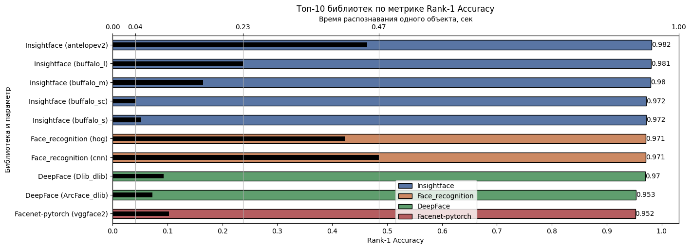
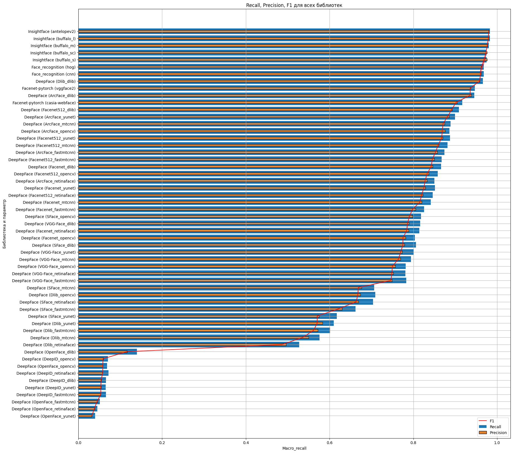

# Анализ существующих открытых решений по распознаванию лиц

| №| Название библиотеки (ссылка на ноутбук)| Описание |
|-|-|:-:|
| 1 | [Facenet-pytorch](https://github.com/NazarovMichail/Diploma-MIPT/blob/master/OSA/OSA%20facenet-pytorch.ipynb)| Детекция и распознавание лиц |
| 2 | [DeepFace обзор](https://github.com/NazarovMichail/Diploma-MIPT/blob/master/OSA/DeepFace.ipynb)| Общий обзор библиотеки |
| 3 |[DeepFace детекция](https://github.com/NazarovMichail/Diploma-MIPT/blob/master/OSA/Face%20detection%20by%20DeepFace.ipynb) | Детекция лиц |
| 4 |[Insightface](https://github.com/NazarovMichail/Diploma-MIPT/blob/master/OSA/OSA%20Insightface.ipynb) | Детекция и распознавание лиц |
| 5 | [Сводный анализ](https://github.com/NazarovMichail/Diploma-MIPT/blob/master/OSA/Total%20OSA%20results.ipynb)| Сводный анализ всех исследованных библиотех |

## Результаты анализа

Топ-10 рассмотренных библиотек по метрике Rank-1 Accuracy и скорости распознавания одного объекта

Топ-10 рассмотренных библиотек по метрике Rank-1 Accuracy и количества нерспознанных объектов

Значения Recall, Precision, F1 для всех рассмотренных библиотек

